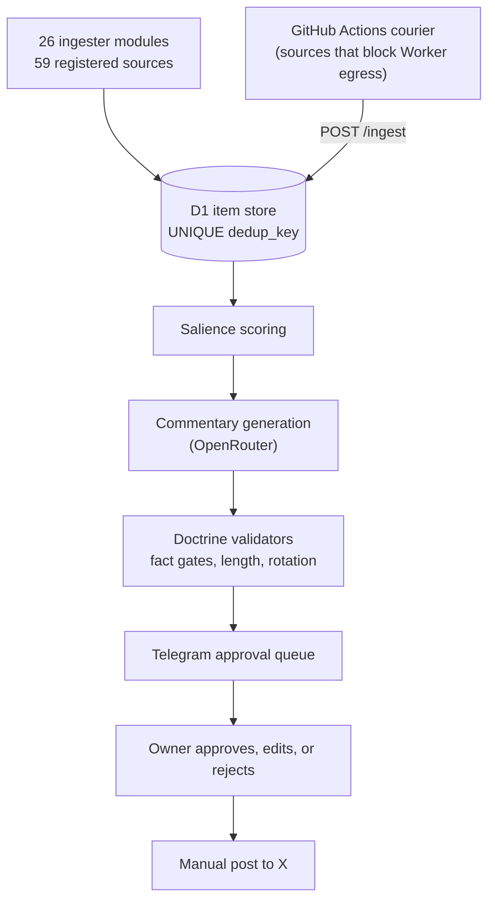

# Skeptic Wire

An automated market-intelligence desk that reads primary financial filings,
drafts short commentary, and refuses to make anything up.

Skeptic Wire polls 59 primary sources (SEC EDGAR, congressional trade
disclosures, central bank rate pages, federal regulators, market-structure
feeds), scores what it finds for salience, generates commentary with an LLM
constrained to parsed fields, and delivers finished cards to a Telegram
approval queue. A human approves each card and posts it manually to X
([@SkepticTrades](https://x.com/SkepticTrades)).

The whole pipeline runs on **one Cloudflare Worker, one cron trigger, and zero
runtime npm dependencies**.

## The constraint that shaped everything

Every number in every post has to come from a field an ingester actually
parsed. If a field did not parse, the post does not claim it. That single rule
is why this codebase looks the way it does: the LLM never sees a blank page, it
receives parsed facts and a template, and machine gates check the output
against the source record before a human ever reads it.

Four other rules follow from it:

- **Primary sources only.** Filed, printed, or released by an official body.
  Nothing sourced to "reportedly."
- **Honest identity.** The account is transparently a brand desk, never a fake
  human, and it never denies being automated.
- **No vendor-data republishing.**
- **No advice language.**

## How it works



### Scheduling without cron triggers

Cloudflare's free plan allows five cron triggers per **account**, not per
Worker. So this project spends exactly one (`* * * * *`) and builds a real
scheduler on top of it: a D1 `jobs` table plus a dispatcher
([src/dispatch.ts](src/dispatch.ts)).

Each tick selects up to `MAX_JOBS_PER_TICK` (24) due jobs by priority, runs
them at `TICK_JOB_CONCURRENCY` (3) in parallel, and stops at a
`TICK_TIME_BUDGET_MS` (45s) wall-clock budget. Jobs reschedule themselves
through cadence profiles ([src/cadence.ts](src/cadence.ts)). Sources that fail
repeatedly are auto-quarantined.

### Deduplication lives in D1, not KV

KV's free tier caps writes at 1,000 per day, which a 59-source poller would
burn through before lunch. Dedup is a `UNIQUE` constraint on `items.dedup_key`
with `INSERT OR IGNORE`, so the database enforces it in one statement. KV holds
only low-write state: template rotation, autonomy counters, and the kill
switch.

### Zero runtime dependencies

Parsing is regex-first on hot paths ([src/lib/xml.ts](src/lib/xml.ts)). This
started as a hard requirement under the free tier's 10ms CPU limit, which
killed the first posts outright. The project moved to Workers Paid on
2026-07-27, but the discipline stayed because it is what keeps ticks inside
budget.

### The courier pattern

Five sources answer a residential connection normally and fail from Cloudflare
Worker egress, each in a different way: Senate eFD 403s datacenter IP ranges,
NSE India resets on the declared User-Agent, treasury.gov fails the TLS
handshake with a 525, and www.cftc.gov returns 403.

For those, a GitHub Actions workflow fetches the raw bytes and POSTs them to
the Worker's authenticated `/ingest` endpoint. The workflow is a **dumb
courier**. It holds no parsing logic, no state, and no judgement beyond a date
window. The Worker parses courier-delivered bytes with the same tested code
every direct poller uses, because a second implementation of the parser is
exactly the failure this design exists to prevent.

## Sources

| Family | Coverage |
|---|---|
| SEC EDGAR | 8-K (plus body text), Form 4, Form 144, Form 25, Schedule 13D/G, 13F holdings and quarter-over-quarter diffs, daily index reconciliation |
| Congress | House Clerk PTRs (PDF extraction), Senate eFD PTRs |
| Central banks | Fed press releases, plus policy rates from BoE, ECB, RBA, BoI, Norges Bank, BoJ, BCB and others |
| Macro | BLS release calendar and watch |
| Market structure | Nasdaq and NYSE trading halts, Reg SHO threshold list, CFTC Commitments of Traders |
| Regulatory | Federal Register, FDA recalls (drug, device, food), FTC and GAO press |
| Other | Treasury auctions, NOAA storm events |

Every endpoint is live-verified during the chunk that adds it, and the evidence
is committed to [docs/verification/](docs/verification/). No endpoint is
trusted from memory.

Any source that is failing, parked, quarantined, or retired is listed with a
status and a date in [docs/SOURCE_REGISTRY.md](docs/SOURCE_REGISTRY.md). A
source missing from that file and from the failure list is working. There is no
third state.

## Repo layout

```
src/
  index.ts          Worker entry: routes + scheduled handler
  dispatch.ts       The real scheduler (D1 jobs table)
  cadence.ts        Reschedule profiles
  ingesters/        26 source-specific parsers
  rag/              Grounded generation, validators, echo detection
  templates/        Archetypes, gates, length, rendering
  telegram/         Approval-queue webhook and schema guard
  lib/              XML, HTML, HTTP, ZIP, time, logging helpers
migrations/         65 D1 migrations, applied in order
docs/verification/  Dated evidence for every endpoint claim
test/               vitest against real workerd with D1 and KV simulators
```

## Local development

```bash
npm install
```

```bash
npm run typecheck
```

```bash
npm test
```

Tests run under `@cloudflare/vitest-pool-workers`, which executes them in real
workerd with real D1 and KV simulators rather than mocks.

Copy `.dev.vars.example` to `.dev.vars` for local `wrangler dev`. `.dev.vars`
is gitignored and must never be committed.

## Configuration

Secrets are set with `wrangler secret put <NAME>` and are never committed.
Non-secret configuration lives in `[vars]` in `wrangler.toml`, deliberately,
because Workers Builds re-applies `[vars]` on every merge deploy and a
dashboard-set value would be silently wiped.

| Name | Kind | Purpose |
|---|---|---|
| `CONTACT_EMAIL` | var | Declared contact in the polling User-Agent (SEC and BLS require one) |
| `POSTING_ENABLED` | var | Master poster gate |
| `QUEUE_TTL_HOURS` | var | How long an unapproved card survives |
| `OPENROUTER_MODEL` | var | Generation model id. Empty means generation holds and the queue accumulates |
| `TELEGRAM_BOT_TOKEN` | secret | Approval bot |
| `TELEGRAM_WEBHOOK_SECRET` | secret | Checked on the webhook route and on admin routes |
| `OPENROUTER_API_KEY` | secret | Generation |
| `INGEST_SECRET` | secret | Authenticates the GitHub Actions courier |

Owner setup, deployment, and incident procedures are in
[docs/RUNBOOK.md](docs/RUNBOOK.md).

## Operations

Kill switch (note `--remote`, since without it wrangler v4 writes to local
simulated storage while production keeps running):

```bash
wrangler kv key put kill_switch 1 --binding KV --remote
```

Resume:

```bash
wrangler kv key delete kill_switch --binding KV --remote
```

## Platform history

Planned for X, moved to Threads on 2026-07-26 when X withdrew its free tier,
then moved back to X as a manual publishing flow on 2026-07-28 after Meta
banned the Threads account on suspected bot activity. The Threads client is
parked rather than deleted, behind `THREADS_PARKED` in
[src/poster.ts](src/poster.ts). The incident record, including how the ban was
distinguished from an expired token, is in
[docs/verification/2026-07-28-threads-ban.md](docs/verification/2026-07-28-threads-ban.md).

## License

Proprietary. All rights reserved. You may read this code; you may not use it.
See [LICENSE](LICENSE).

Nothing here is financial advice.
